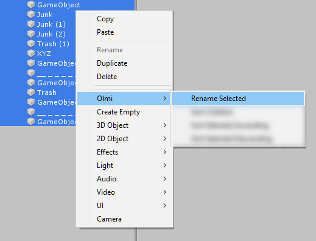
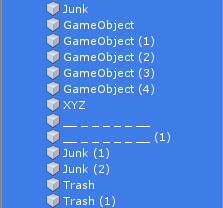
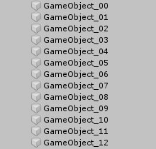
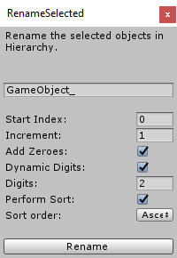

# RenameSelected

An editor script to help keep the Hierachy neat and tidy.

I've always been annoyed that Unity doesn't have the nowadays basic functionality of batch renaming, so I made my own tool for this. It opens conveniently via the right button context menu, so there's no need to go to top menu bar or elsewhere.

Renaming is only applied to the currently selected objects in hierarhchy.

Selections in multiple hiearchies is also supported, **but parent-child combinations are not**.

With a few clicks, you get this result:

 

## UI

The right click menu item opens up a floating window:

## Features

- Selection can be under many parent objects
    - Children will be renamed and sorted under their parent
    - Although parent and child simulateous selection does not work

- Select a new name

- Indexing
    - Start index for numbering
    - Index increment/stride

- Add leading zeroes (padding)

- Dynamic digit mode
    - i.e. if there's 3-digit numbers, override UI defined 2-digits
- Sort the results

- Undo
    - All operations should undo correctly

## Notes

Even though I stated it already, this script does not support renaming objects in *project* window, i.e. Assets on disk.

Developed on Unity 2018.4.12f1. Will most likely work on later versions, too.
